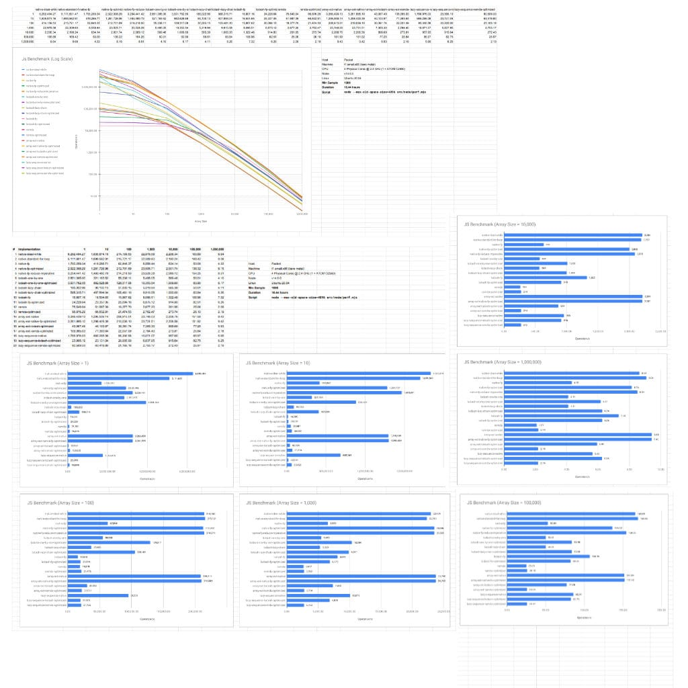

【Skill Boost Plan】SB03 javascript declarative cost

## Purpose

Understand the performance of writing a declarative style coding in js.

Completing this exercise could help you to figure out the following questions:

- Do you know the trade-off of writing a functional implementation in js?

- Do you know how to write a fastest and super efficient implementation in js?

- Do you know the js libraries you used every day added how much overhead?

- Is optimizing a functional implementation worth trying in js?

## Exercise Details

Given that, there are two black-box functions and one array with the following
declarations,

```js
const arr = [
  {
    id: number,
    name: string,
    someNum: number,
  },
]
const someTransform = ({ someNum }) => number | null
const someCalculation = number => number
```

The possible `arr` sizes are in `{1, 10, 100, 1000, 10000, 100000, 1000000}`.

#### Computational Tasks(order is important):

1.  apply a black-box function `someTransform` on each value in `arr`
2.  remove null values in `arr`
3.  remove duplicate values in `arr`
4.  apply a black-box function `someCalculation` on each value in `arr`
5.  calculate the sum of the values
6.  return the total sum

---

For a pure learning purpose, you are suggested to develop three versions:

1. A "fastest" version to compute all the tasks.

2. A "declarative" style version that is the simplest to understand, debug and trace.
   (functional approach)

3. Based on 2, try to optimize 2 to a faster "declarative" style implementation.

P.S. Optimization often requires a trade-off but try to sacrifice as little as possible to
optimize the performance and maintain the simplicity. You could use any js library to
complete those implementations.

#### Learning Bonus

1. If you used vanilla javascript for those implementations, try to use famous libraries
   like `lodash` and `ramda` to implement and benchmark in ALL array sizes again.

2. If you used `lodash` or `ramda` for those implementations, try to use vanilla
   javascript to implement and benchmark in ALL array sizes again.

3. If you think a lazy evaluation is an important feature in general. Try to use vanilla
   javascript to implement with
   [iterator pattern](https://developer.mozilla.org/en-US/docs/Web/JavaScript/Guide/Iterators_and_Generators#Iterators).

## Getting Start

1. Clone this project and install npm modules

```
git clone https://github.com/gaplotech/SB03-js-declarative-cost
yarn install
```

2. Complete your implementation in `src/perf-impl.js`

3. Test your implementation correctness

```
yarn test
```

4. Test the performance

```
# roughly, shorter iteration and small samples
yarn benchmark:rough

# precisely, minimum 200 samples
yarn benchmark:precise
```

5. You could submit your pull request and ask for review and discuss before the official
   answer release.

## Answer

<details>
  <summary>Check Answers</summary>

A short answer and conclusion will be posted on 7/Sep 2020.

(TLDR;) If you have no time to complete this exercise, you could read my comprehensive
[R&D findings(implemented 20 versions)](https://www.patreon.com/posts/41204692) via
patreon.

In order to get an accurate benchmark, we need to make sure the benchmark environment has
no significant workload, no performance thermal throttling and no affection with noisy
neighbour(if VM). That's why I have rented a
[packet bare metal machine (t1.small.x86) in NTR](https://www.packet.com/cloud/servers/t1-small/)
to perform the benchmark with minimum 1000 samples for each benchmark.

As a result, the whole benchmark `1000 sample * 20 implementation * 7 size` takes 16.44
hours to run! The final result combined with the source code provided in patreon is
stunning and fascinating! It gives you a good insight between declarative style,
performance and functional optimization techniques in js.

[Early Access - JS Benchmark in 20 different implementations for same purpose](https://www.patreon.com/posts/41204692)

#### Sneak Peek



</details>
